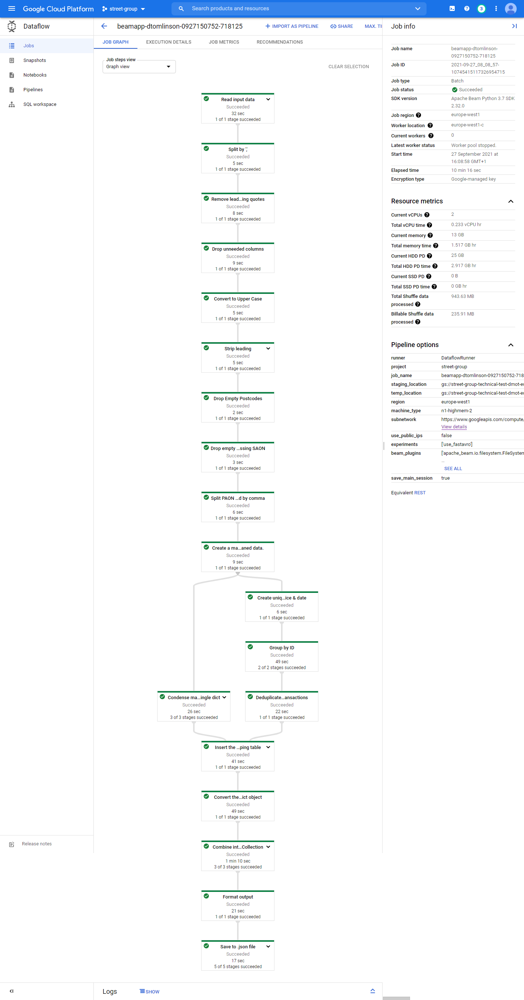

# Running on DataFlow

The pipeline runs as is on GCP DataFlow. The following documents how I deployed to my personal GCP account but the approach may vary depending on project/account in GCP.

## Prerequisites

### Cloud Storage

- A Cloud Storage bucket with the following structure:

```
./input
./output
./tmp
```

- Place the input files into the `./input` directory in the bucket.

### VPC

To get around public IP quotas I created a VPC in the `europe-west1` region that has `Private Google Access` turned to `ON`.

## Command

!!! tip
    We need to choose a `worker_machine_type` with sufficient memory to run the pipeline. As the pipeline uses a mapping table, and DataFlow autoscales on CPU and not memory usage, we need a machine with more ram than usual to ensure sufficient memory when running on one worker. For `pp-2020.csv` the type `n1-highmem-2` with 2vCPU and 13GB of ram was chosen and completed successfully in ~10 minutes using only 1 worker.

Assuming the `pp-2020.csv` file has been placed in the `./input` directory in the bucket you can run a command similar to:

!!! caution
    Use the command `python -m analyse_properties.main` as the entrypoint to the pipeline and not `analyse-properties` as the module isn't installed with poetry on the workers with the configuration below.

```bash
python -m analyse_properties.main \
    --runner DataflowRunner \
    --project street-group \
    --region europe-west1 \
    --input gs://street-group-technical-test-dmot-euw1/input/pp-2020.csv \
    --output gs://street-group-technical-test-dmot-euw1/output/pp-2020 \
    --temp_location gs://street-group-technical-test-dmot-euw1/tmp \
    --subnetwork=https://www.googleapis.com/compute/v1/projects/street-group/regions/europe-west1/subnetworks/europe-west-1-dataflow \
    --no_use_public_ips \
    --worker_machine_type=n1-highmem-2
```

The output file from this pipeline is publically available and can be downloaded [here](https://storage.googleapis.com/street-group-technical-test-dmot-euw1/output/pp-2020-00000-of-00001.json).

The job graph for this pipeline is displayed below:


